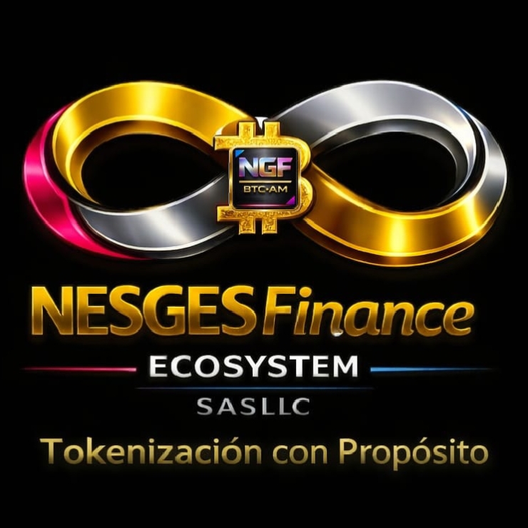
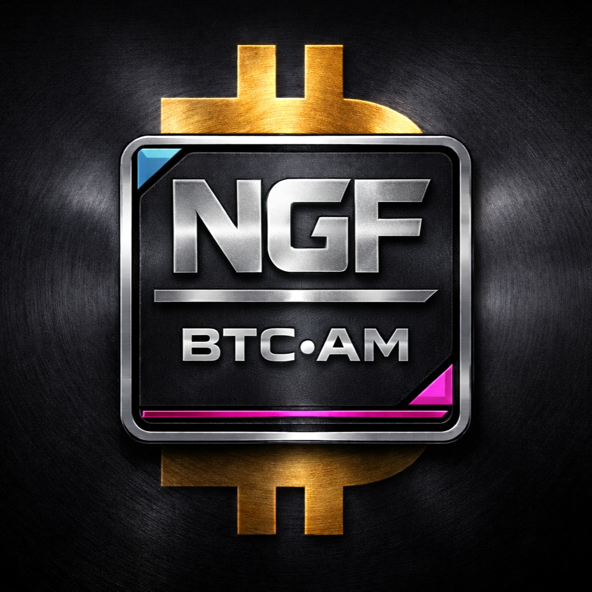

<!--
  README principal — NESGESFinanceTrust
  Copyright ®NESGESFinance Ecosystem S.A.S. BIC. & LLC. EIN: 0008086872
-->
# NESGESFinanceTrust

<p align="center">
  
  
</p>

<p align="center"><strong>Infraestructura técnica Bitcoin L1 · Runes · Ordinals · Tokenización RWA del ecosistema NESGESFinance</strong></p>

⚠️ **Estado de auditoría:** Esta plataforma está actualmente en etapa de **auditoría técnica y testeo de conectores**. Los datos, módulos y funcionalidades visibles pueden corresponder a pruebas de integración y no reflejan necesariamente el estado final ni la disponibilidad definitiva del servicio.

---

Plataforma de **indexación de Bitcoin y tokenización de Activos del Mundo Real
(RWA)** de la **NESGESFinance Ecosystem**. Indexa bloques, mempool, **Runes**
(Utility Token), **Ordinals** (Security Tokens) y registra RWA con
cumplimiento normativo, exponiendo una API REST/WebSocket y un panel web.

> **Plataforma:** nesgesfinancetrust.com · **Versión:** v3.4-dev-audit (Agosto 2026)
> **Lema:** *"Y a tu prójimo como a ti mismo"*
> **Web:** [https://nesgesfinance.org](https://nesgesfinance.org)
> **Whitepaper:** [`NESGESFinance Ecosystem — Documento Maestro Institucional, Tecnológico y de Proyectos 2026`](./NESGESFinance%20Ecosystem%20Mini%20Whitepaper%20Institucional%202026%20(2).pdf)

---

## Identidad y doctrina

**NESGES** — Núcleo Estratégico y de Gestión para la Comunidad y Ecosistemas
Sostenibles, Financieros, Tecnológicos y Tokenizados.

**Doctrina:** *"Tokenización con Propósito"* — la representación digital debe
estar subordinada al activo real, al expediente jurídico, a la trazabilidad y
a la utilidad productiva.

**Estructura corporativa dual:**

| Entidad | Jurisdicción | Identificador | Función |
|---|---|---|---|
| NESGESFinance Ecosystem S.A.S. BIC | Ecuador (Ibarra) | RUC 1091799299001 | Coordinación tecnológica e impacto BIC local |
| NESGESFinance Ecosystem S.A.S. LLC | Nuevo México, EE.UU. | File #3168825 · EIN 0008086872 | Propiedad intelectual, infraestructura y expansión internacional |
| NESGESFinanceTrust | En proceso de formalización | — | Capa patrimonial/fiduciaria, cumplimiento normativo y primer SPV piloto |

---

## Ecosistema de activos

- **NGF•BTC•AM** → Rune de utilidad #208,645 (ID `923867:120`), supply fijo de
  5.930.000.000 NGF, sin derechos económicos directos sobre proyectos.
- **Runes** → Utility Token fungible nativo (protocolo de Casey Rodarmor, bloque 840000).
- **Ordinals** → Security Tokens y contenedores de metadatos de RWA; cada
  proyecto emite una serie independiente con Reglamento de Emisión y SPV propio.
- **Taproot Assets + Lightning** → liquidez y liquidación en capa 2 (L2).

## Arquitectura (resumen)

```
Bitcoin Core RPC / Esplora  →  blocks.ts / indexadores  →  MySQL/MariaDB + Redis
                                           │
                                           ▼
                               API REST (/api) + WebSocket (/ws)
                                           │
                                           ▼
                      Frontend HTML5 + CSS3 + JavaScript vainilla
```

Detalle completo en [`docs/ARQUITECTURA.md`](./docs/ARQUITECTURA.md).

> **Nota de auditoría:** Esta arquitectura se considera de referencia y está sujeta a confirmación tras la conclusión de la auditoría técnica.

## Requisitos

- **Node.js** ≥ 18
- **MariaDB** 10.11 (o MySQL 8)
- **Redis** 7
- **Bitcoin Core** (JSON-RPC) o un backend **Esplora**

## Instalación

```bash
# 1. Instalar dependencias del backend
npm install

# 2. Configurar variables de entorno
cp .env.example .env      # editar credenciales de BD, Redis y Bitcoin

# 3. Ejecutar migraciones de base de datos
npm run migrate

# 4. Compilar y arrancar
npm run build && npm start
#   o, en desarrollo con recarga:
npm run dev
```

El frontend estático se sirve desde `frontend/` (por Nginx o cualquier
servidor de estáticos). El backend escucha en el puerto `3000` por defecto.
El script `npm run migrate` ejecuta las migraciones SQL ubicadas en
`backend/migrations/` y crea la base de datos si aún no existe.

## Scripts npm

| Script            | Acción                                        |
|-------------------|-----------------------------------------------|
| `npm run build`   | Compila TypeScript a `dist/`.                 |
| `npm start`       | Arranca el servidor compilado.                |
| `npm run dev`     | Desarrollo con `ts-node-dev` (recarga).       |
| `npm run typecheck` | Verificación de tipos (`tsc --noEmit`).     |
| `npm run lint`    | Análisis estático con ESLint.                 |
| `npm run migrate` | Aplica las migraciones SQL.                   |
| `npm test`        | Pruebas con Jest.                             |

## Variables de entorno principales

Ver [`.env.example`](./.env.example). Incluyen: `APP_PORT`, `API_PREFIX`,
`DB_HOST`/`DB_USER`/`DB_PASSWORD`/`DB_NAME`, `REDIS_HOST`/`REDIS_PORT`,
`BITCOIN_RPC_URL`/`BITCOIN_RPC_USER`/`BITCOIN_RPC_PASSWORD`, `ESPLORA_URL`.

## API

Endpoints REST y canales WebSocket documentados en [`docs/API.md`](./docs/API.md).
Resumen:

- `GET /api/health`
- `GET /api/blocks/recent`
- `GET /api/blocks/:height`
- `GET /api/mempool` · `/fees` · `/recent`
- `GET /api/runes` · `/id/:block/:tx` · `/:name` · `/:name/holders`
- `GET /api/ordinals/inscriptions` · `/inscription/:id` · `/content/:id`
- `GET /api/rwa/assets` · `/:id` · `/:id/history` · `POST /assets` · `POST /assets/:id/transfer`
- WebSocket `/ws` (canales: `blocks`, `mempool`, `runes`, `ordinals`, `rwa`)

## Estructura del proyecto

```
nesgesfinancetrust/
├── backend/
│   ├── src/
│   │   ├── index.ts, config.ts, logger.ts, database.ts
│   │   ├── api/            # blocks, mempool, runes, ordinals, rwa, websocket
│   │   ├── bitcoin/        # clientes RPC/Esplora + crypto
│   │   ├── repositories/   # acceso a datos por dominio
│   │   ├── interfaces/     # contratos de tipos
│   │   └── utils/          # bitcoin-script, varint, compliance
│   └── migrations/         # 001..004 (SQL)
├── frontend/
│   ├── index.html, dashboard1.html, explorer.html, dashboard2.html, rwa-marketplace.html
│   ├── status.html, developers.html, verify.html, institucional.html
│   ├── assets/ (css, js, img)
│   └── components/         # fragmentos HTML reutilizables
├── docs/                   # API, ARQUITECTURA, RUNES, ORDINALS, COMPLIANCE
├── nginx/                  # configuración de servidor
├── docker-compose.yml
├── package.json, tsconfig.json, .env.example
└── README.md
```

## Documentación

- [`docs/API.md`](./docs/API.md) — Referencia de la API.
- [`docs/ARQUITECTURA.md`](./docs/ARQUITECTURA.md) — Arquitectura del sistema.
- [`docs/RUNES_PROTOCOL.md`](./docs/RUNES_PROTOCOL.md) — Protocolo Runes y NGF•BTC•AM.
- [`docs/ORDINALS_PROTOCOL.md`](./docs/ORDINALS_PROTOCOL.md) — Protocolo Ordinals y tokens de proyecto.
- [`docs/COMPLIANCE.md`](./docs/COMPLIANCE.md) — Cumplimiento KYC/AML/MiCA y proceso F0–F6.
- [`docs/TOKENOMICA.md`](./docs/TOKENOMICA.md) — Tokenómica oficial v5.0.
- [`docs/PROYECTOS.md`](./docs/PROYECTOS.md) — Portafolio de proyectos y proceso de postulación.
- [`docs/WHITEPAPER.md`](./docs/WHITEPAPER.md) — Documento Maestro Institucional 2026 (resumen y referencias).
- [`docs/BRANDING.md`](./docs/BRANDING.md) — Guía de branding y uso de logotipos oficiales.

## 🎨 Branding y Logotipos

| Asset | Ruta | Uso principal |
| --- | --- | --- |
| NESGESFinance Ecosystem | `assets/logos/NESGESFinance_Logo.jpg` | Encabezados institucionales, documentos corporativos y piezas del ecosistema. |
| NGF•BTC•AM | `assets/logos/NGF-BTC-AM.jpg` | Activos vinculados a Bitcoin, Runes, fichas visuales y comunicaciones específicas del producto. |

Referencias relacionadas:

- [Guía completa de branding](docs/BRANDING.md)
- [Manifest de assets](assets/manifest.json)

## Créditos

- **Empresa:** NESGESFinance Ecosystem S.A.S. BIC. & LLC. — EIN: 0008086872
- **CEO-Fundador:** Cbr. Joan Santiago Ramírez Almeida
- **Plataforma:** nesgesfinancetrust.com · [https://nesgesfinance.org](https://nesgesfinance.org)

## Licencia

®NESGESFinance Ecosystem S.A.S. BIC. & LLC. EIN: 0008086872 — TODOS LOS DERECHOS RESERVADOS 2025-2026
